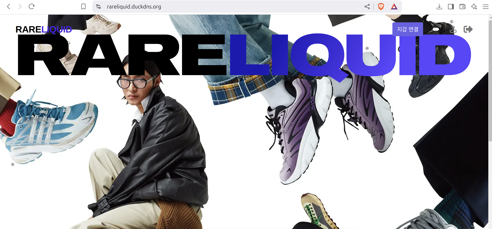
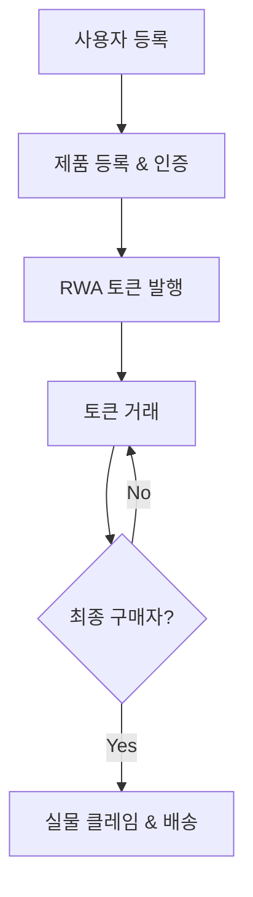

# RareLiquid

## 프로젝트 개요 (Project Overview)

RareLiquid는 한정판 스니커즈 리셀 시장의 비효율성과 높은 수수료 문제를 해결하기 위해 설계된 블록체인 기반 글로벌 리셀 플랫폼입니다. 현재 스니커즈 리셀 시장은 2023년 기준 75억 달러 규모로 성장하며 연평균 5-7%의 성장률을 보이고 있지만, 거래 과정에서의 인증 지연, 높은 수수료, 진품 불안감 등으로 사용자 경험과 비용 효율성이 저하되고 있습니다.

RareLiquid는 RWA(Real World Asset) 토큰화를 통해 실물 자산을 디지털화하고, 이를 기반으로 빠르고 저렴하며 신뢰할 수 있는 거래 환경을 제공합니다. 본 프로젝트는 기존 플랫폼(예: KREAM, StockX, GOAT 등)의 한계를 극복하고, 판매자와 구매자 모두에게 경제적 이익과 편리함을 제공하는 것을 목표로 합니다.

## 문제 정의 및 해결방안 (Problem & Solution)

### 문제점 (Problems)

| 문제 | 설명 |
|------|------|
| 높은 수수료 | 기존 리셀 플랫폼은 평균 10% 이상의 수수료(판매자+구매자 기준)를 부과하며, 배송비와 검수 비용이 추가로 발생합니다. 예: KREAM에서 30만 원 상품 거래 시 총 수수료는 약 33,600원(Level 1 기준)입니다. |
| 거래 지연 | 인증(1-5일)과 배송(5-12일)으로 인해 거래 소요 시간이 3일에서 2주 이상 걸리며, 매 거래마다 반복됩니다. |
| 진품 인증 불안감 | 가짜 제품 유통으로 인해 소비자 신뢰도가 낮아지고, 중개자의 검수 과정은 비용과 시간을 증가시킵니다. |
| 시장 불공정성 | 동일 제품임에도 플랫폼별로 수수료와 가격이 달라 혼란을 초래합니다. |

### 해결방안 (Solutions)

| 솔루션 | 설명 |
|--------|------|
| RWA 토큰화 | 실물 스니커즈를 최초 검증 후 디지털 토큰(RWA)으로 전환하여, 이후 거래는 토큰 단위로 진행합니다. 이를 통해 반복 검수와 배송을 제거하고 비용을 절감합니다. |
| 낮은 수수료 구조 | 거래 수수료를 1%로 고정(VAT 및 배송비 제외)하여, KREAM 대비 약 82% 저렴한 비용(예: 30만 원 상품 거래 시 총 수수료 6,000원)을 제공합니다. |
| 효율적 거래 | 토큰화된 자산은 물리적 배송 없이 거래되며, 최종 구매자가 클레임 시에만 배송이 이루어져 거래 속도가 획기적으로 개선됩니다. |
| 블록체인 기반 신뢰 | 소유권 변동 내역을 블록체인에 기록하여 진품 여부를 투명하게 보장합니다. |

## 주요 기능 (Features)

- **RWA 토큰화**: 한정판 스니커즈를 검증 후 디지털 자산으로 변환, 토큰 단위로 거래 가능
- **단일 검증 시스템**: 최초 1회 검증으로 반복 검수 제거, 비용과 시간 절약
- **저렴한 수수료**: 판매자와 구매자 모두 1% 수수료 적용, 배송비와 VAT 제외
- **빠른 거래**: 토큰 거래를 통해 물리적 배송 없이 즉시 소유권 이전 가능
- **클레임 기능**: 최종 구매자가 RWA 토큰을 실물로 전환 요청 시 배송 제공
- **블록체인 기록**: 모든 거래와 소유권 변동을 블록체인에 기록하여 투명성과 신뢰성 확보
- **유저 플로우 간소화**: 기존 플랫폼 대비 배송 및 검수 단계를 최소화하여 사용자 편의성 증대

## 기술 스택 (Tech Stack)

| 영역 | 기술 |
|------|------|
| 블록체인 | XRPL EVM Sidechain |
| 스마트 컨트랙트 | Solidity, RWA 토큰화 로직 라이브러리 |
| 프론트엔드 | Express Pug Template Language, SSR 렌더링 |
| 백엔드 | Node.js, Express, REST API |
| 데이터베이스 | MongoDB |
| 스토리지 | 로컬 서버 스토리지 |
| 인증 시스템 | Google OAuth2 |
| 결제 시스템 | XRPL EVM Sidechain 기반 결제 |

## 유저 플로우 (User Flow)

## 기대효과 (Expected Effects)

- **비용 절감**: KREAM 대비 거래당 약 27,600원(82%) 절약(30만 원 상품 기준)
  - 100회 거래 시 3,360,000원(KREAM) vs 600,000원(RareLiquid)
- **시간 단축**: 반복 검수와 배송 제거로 거래 시간이 즉시(토큰 거래) 또는 최종 클레임 시 1회 배송으로 단축
- **시장 확대**: 저렴한 수수료와 빠른 거래로 전문 리셀러 및 일반 사용자 유입 증가
- **신뢰도 향상**: 블록체인 기록으로 가짜 제품 유통 방지 및 소비자 신뢰도 상승

## 발전 가능성 (Future Improvements)

- **다양한 자산 확장**: 스니커즈 외 명품, 예술품 등 다른 고가 실물 자산으로 RWA 토큰화 확장
- **글로벌 시장 진출**: StockX, GOAT 등 기존 글로벌 플랫폼과의 경쟁을 통해 시장 점유율 확대
- **생산자 협업**: 제조 단계에서부터 RWA 토큰 발행으로 초기 검증 비용 제거 및 공급망 효율화
- **커뮤니티 강화**: 사용자 참여형 거버넌스 도입으로 플랫폼 정책에 대한 투명성 및 참여도 제고
- **기술 고도화**: AI 기반 진품 인증 강화 및 거래 예측 모델 개발로 사용자 경험 개선

## 컨트랙트 주소 (Contract Address)

**Testnet**: `0xa0DD5Ff55f87Dd871F76060961291D0d98e306B8`

## 팀원 (Team Members)

| 이름 | 역할 | 담당 업무 |
|------|------|-----------|
| 지도일 | 팀장 & 백엔드 개발 | 프로젝트 총괄, 백엔드 아키텍처 설계 |
| 김소희 | 프론트엔드 개발 | UI/UX 디자인, 사용자 인터페이스 구현 |
| 강두훈 | 블록체인 개발 | 스마트 컨트랙트 작성, RWA 토큰화 구현 |
| 김민관 | 백엔드 개발 | 데이터베이스 설계, API 개발 |
| 김시윤 | 프론트엔드 개발 | 웹 페이지 구현, 사용자 경험 최적화 |
| 최명하 | QA & 테스트 | 품질 보증, 테스트 자동화 |
| 박은서 | 기획 & 마케팅 | 비즈니스 전략, 마케팅 기획 |

## 라이센스 (License)

이 프로젝트는 MIT 라이센스에 따라 라이센스가 부여됩니다. 자세한 내용은 [LICENSE](LICENSE) 파일을 참조하세요.

---

© 2025 RareLiquid Team. All Rights Reserved.
